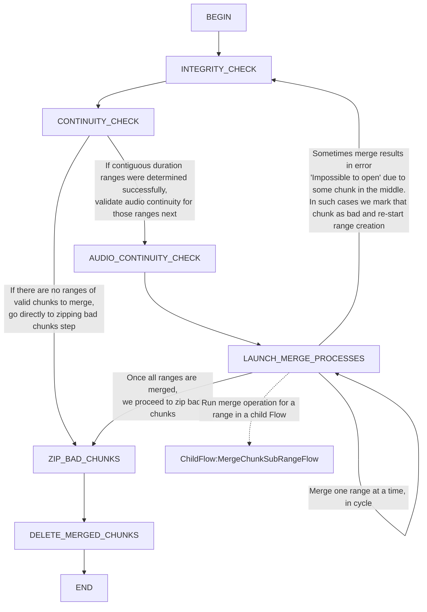
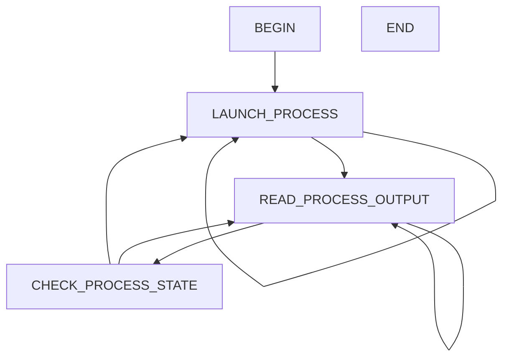
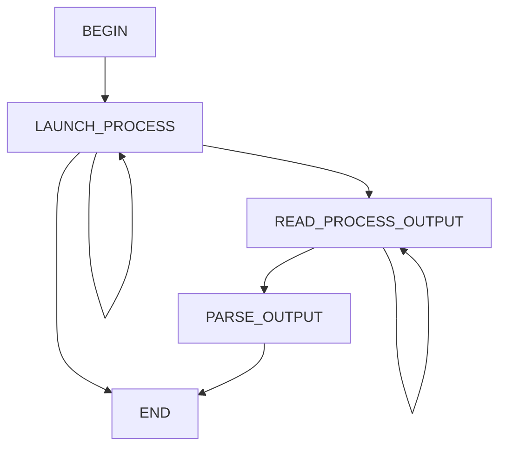
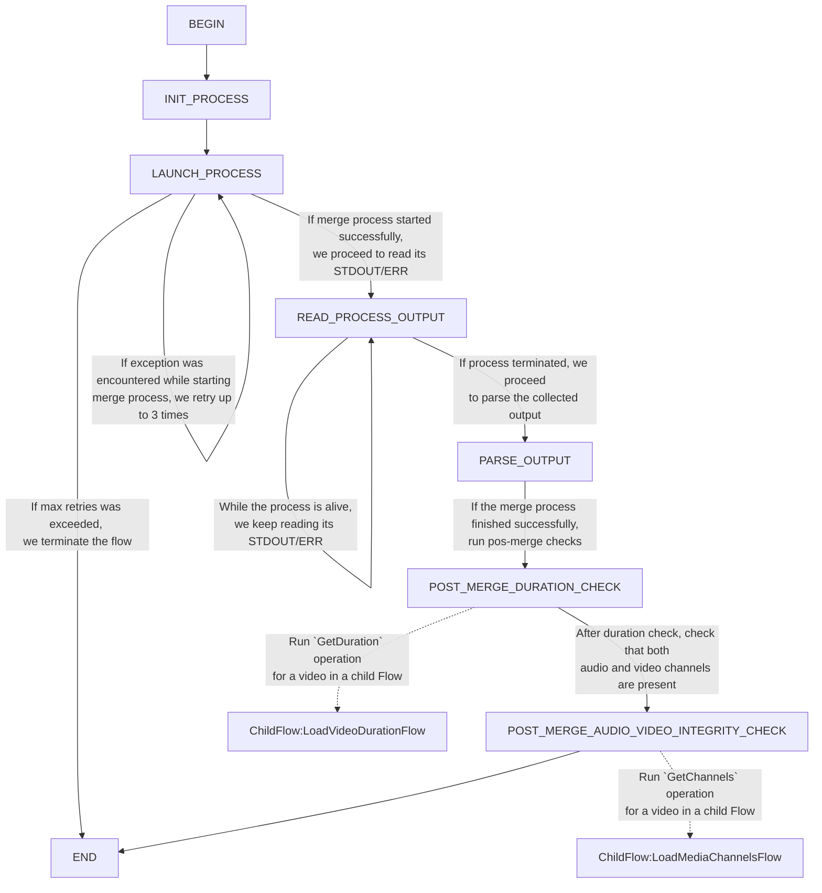
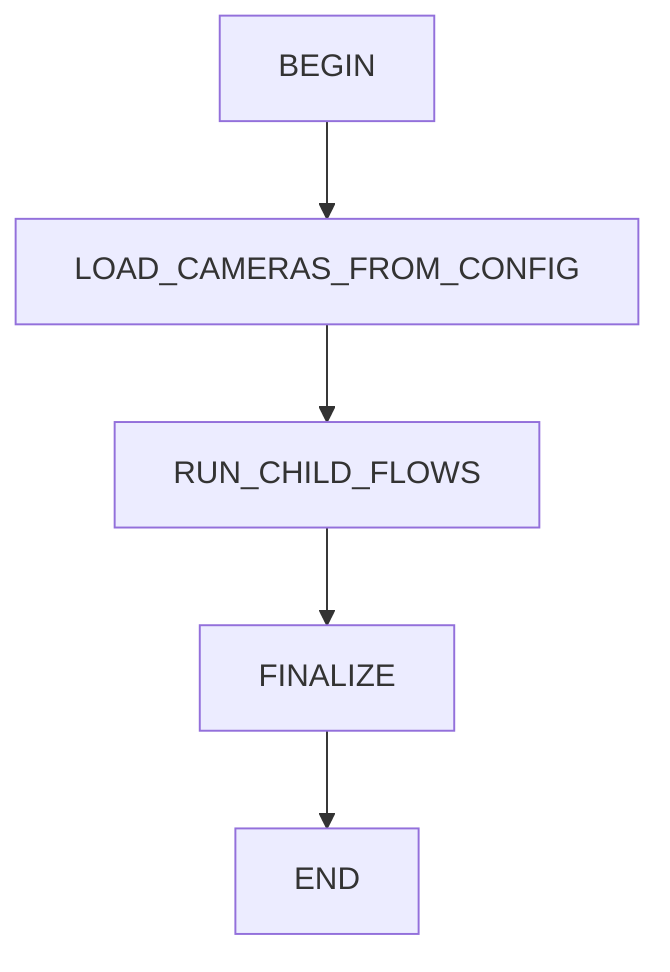
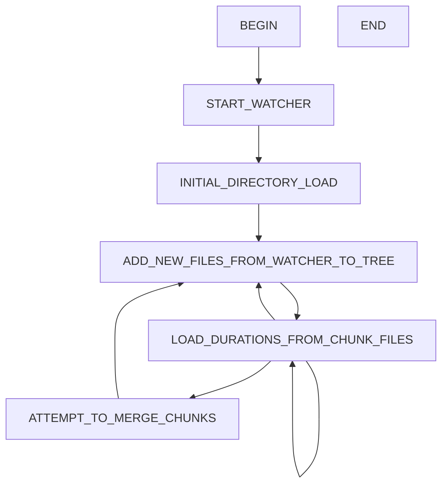
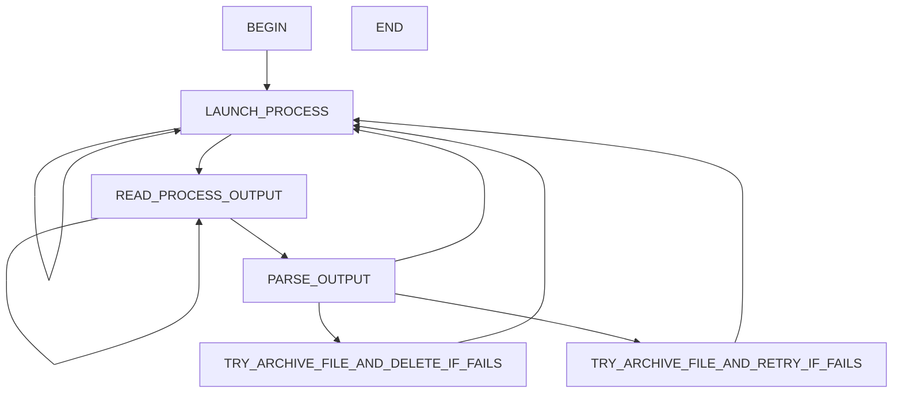

export JAVA_HOME=/home/john/.jdks/graalvm-jdk-17.0.11

echo $JAVA_HOME

./gradlew shadowJar -Dorg.gradle.java.home=/home/john/.jdks/graalvm-jdk-17.0.11

- AnalyzeAndMergeChunkRangeFlow

- CameraProcessRunnerFlow

- LoadVideoChannelsFlow

- LoadVideoDurationFlow

- MergeChunkSubRangeFlow

- MainIngestorFlow

- VideoChunkManagerFlow

- VideoFootageArchiverFlow

