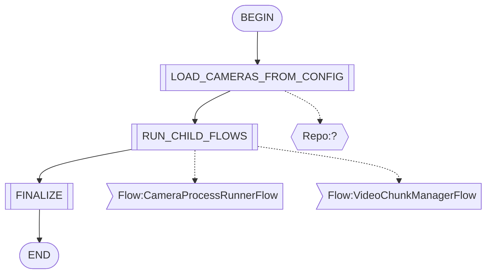
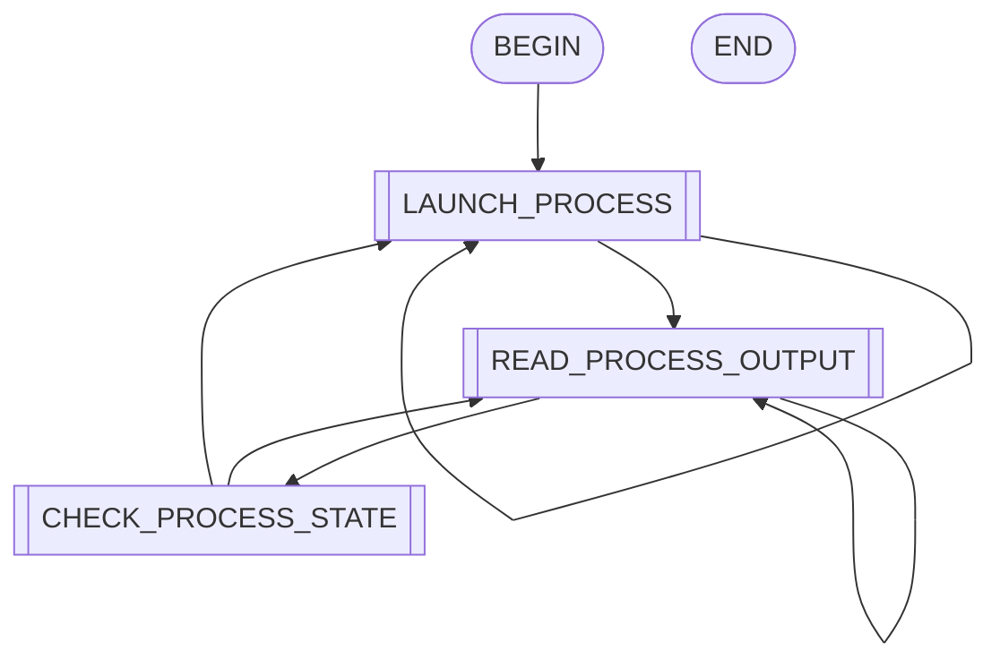
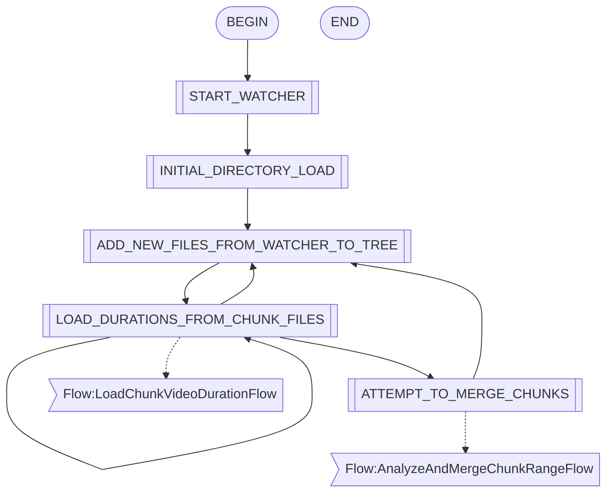
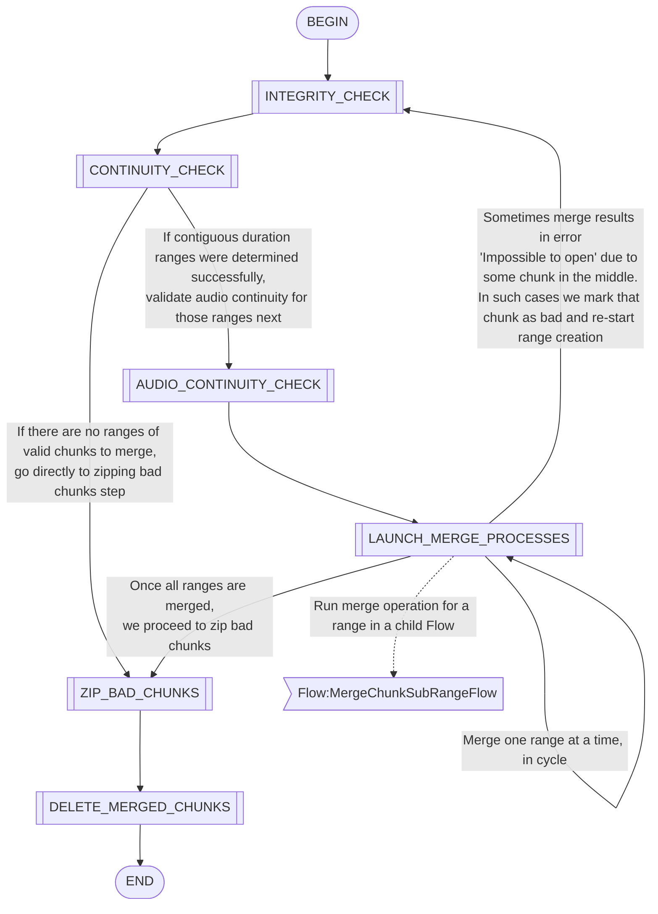
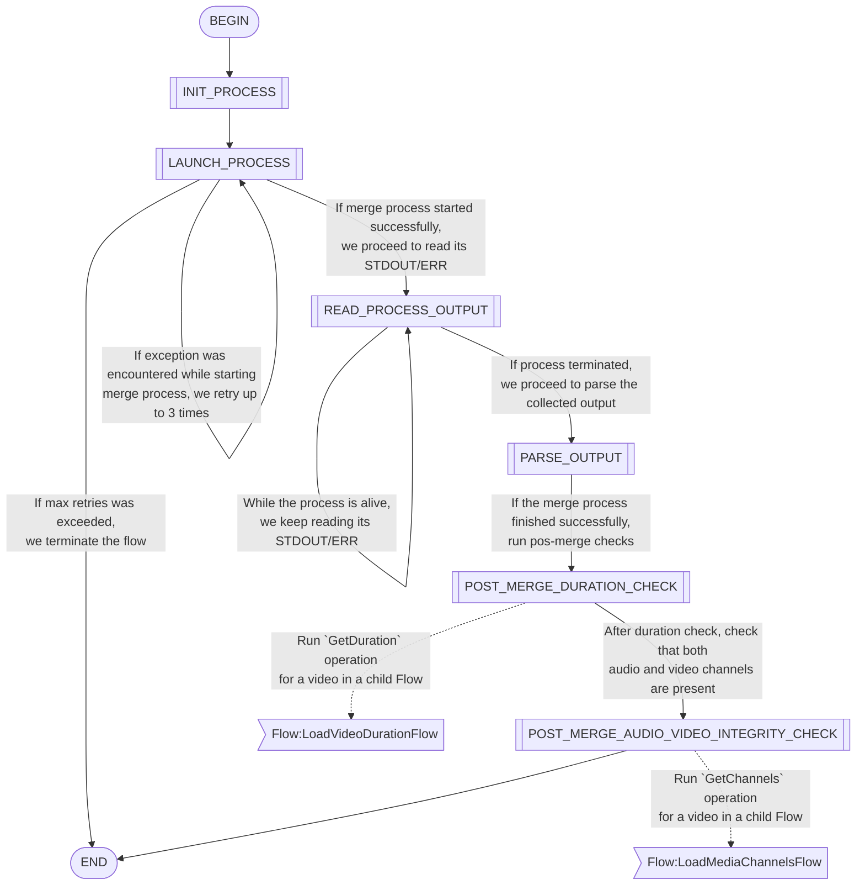
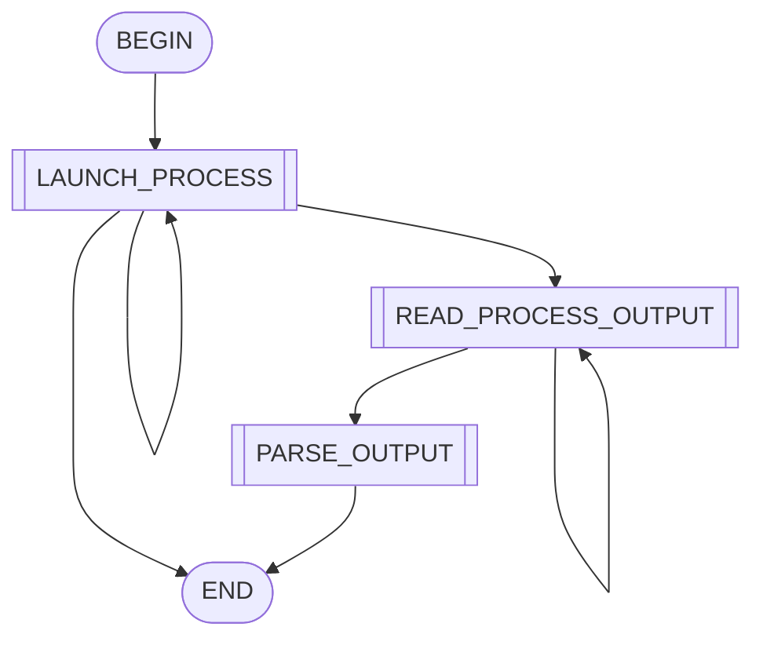

- MainIngestorFlow

- CameraProcessRunnerFlow

- VideoChunkManagerFlow

- LoadChunkVideoDurationFlow

- AnalyzeAndMergeChunkRangeFlow

- MergeChunkSubRangeFlow

- LoadVideoDurationFlow

- LoadMediaChannelsFlow

